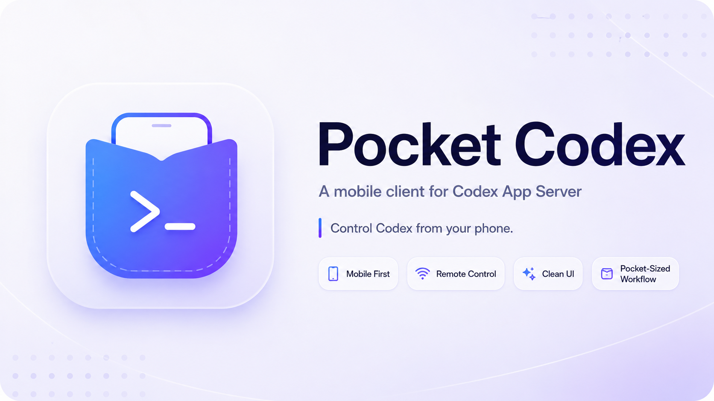

<p align="center">
  
</p>

<h1 align="center">Pocket-Codex</h1>

<p align="center">
  <em>Carry your Codex in your pocket. Drive it natively from any device.</em>
</p>

<p align="center">
  <a href="#status"></a>
  <a href="https://www.rust-lang.org"></a>
  <a href="https://flutter.dev"></a>
  <a href="LICENSE"></a>
</p>

> [!WARNING]
> **Pocket-Codex is under active development.** Nothing here is stable
> yet — APIs, on-disk layout, the protocol mapping and even the crate
> boundaries are expected to change without notice. Do **not** depend on
> it for production workloads. Pull requests, design feedback and bug
> reports are very welcome while we hammer out the foundations.

## What is this?

Pocket-Codex is an experiment in turning the upstream
[`codex app-server`](https://github.com/openai/codex) protocol into a
portable, multi-device experience, and additionally exposing the host's
Codex login as a relay-reachable Responses API endpoint for any device:

- A pure-Rust CLI manages a local `codex app-server` process on the
  machine where Codex is installed.
- The same CLI ships an in-process **Responses API proxy** that reuses
  the host's `codex login` (ChatGPT account or `CODEX_ACCESS_TOKEN`) to
  serve OpenAI-compatible `/v1/responses` HTTP + WebSocket traffic, so
  devices *without* Codex installed can drive the same model through
  the relay.
- The CLI uses [`pb-mapper`](https://github.com/acking-you/pb-mapper) to
  register either service under `pcx:<device>:<kind>:<name>` keys, or
  to subscribe to remote ones, materialising them as local TCP
  endpoints.
- A Flutter front-end (driven through `flutter_rust_bridge`) consumes
  the app-server JSON-RPC protocol directly, giving every platform a
  native UI for Codex without re-implementing model logic.

In short: **one machine stays logged in to Codex; every other device —
the Flutter UI, a remote `codex` CLI, or any OpenAI-compatible tool —
reaches it through the relay.**

## Status

| Area                           | State                                  |
| ------------------------------ | -------------------------------------- |
| Workspace / lints / CI         | bootstrapped                           |
| `pocket-codex` CLI             | `init`, `serve`, `connect`, `api {serve,connect}`, `services {list,default set}`, top-level `status`/`stop`, `codex {start,stop,status}`, `pb {register,subscribe,status}`, `remote-hint`, `version` |
| `pb-mapper` register/subscribe | wired through `deps/pb-mapper`         |
| `codex app-server` supervision | spawn/stop/status via PID + state.toml |
| Direct Responses API proxy     | local HTTP/WS proxy registered through pb-mapper |
| Flutter UI (`apps/flutter`)    | P1: onboarding (relay+key, `pcx1:` import/export), service discovery, API-service subscribe, settings; responsive Material 3 (light/dark). P2: app-server sessions |

The first usable milestone now covers multi-device CLI flows:

- `pocket-codex init [--relay <host:port>] [--key <32B>]` persists the
  default relay address and shared `MSG_HEADER_KEY` to
  `~/.config/pocket-codex/config.toml` (0600 on Unix). All subsequent
  commands default to this config (precedence: `--relay` flag > config >
  `$PB_MAPPER_SERVER`); `--relay` still overrides per-invocation.
- `pocket-codex serve --relay <host:port>` starts or reuses the local
  `codex app-server`, registers it as `pcx:<device>:app:<name>` and
  prints the matching client-side command.
- `pocket-codex connect --relay <host:port>` subscribes to the remote
  app-server selected by `--device` / local default / relay discovery,
  exposes it locally and prints the exact `codex --remote ...`
  invocation to start Codex against that listener.
- `pocket-codex api serve --relay <host:port>` exposes the host Codex
  login as a loopback Responses API proxy and registers
  `pcx:<device>:api:<name>`.
- `pocket-codex api connect --relay <host:port>` subscribes to that API
  proxy and prints a local `model_providers` config snippet for Codex.
- `pocket-codex services list --relay <host:port>` discovers available
  `pcx:*` services; `pocket-codex services default set ...` records the
  local default device when a command does not specify one.

See [`AGENTS.md`](AGENTS.md) for the detailed roadmap and contributor
conventions.

## Repository layout

```
pocket-codex/
├── apps/
│   └── flutter/                 # Flutter UI (FRB-driven, FVM-locked)
├── assets/
│   └── logo/                    # Project artwork (poster, logo)
├── crates/
│   ├── pocket-codex-core        # shared types, config, state, paths
│   ├── pocket-codex-codex       # codex app-server process manager
│   ├── pocket-codex-pb          # pb-mapper register/subscribe glue
│   ├── pocket-codex-cli         # `pocket-codex` binary
│   └── pocket-codex-bridge      # cdylib consumed by flutter_rust_bridge
├── deps/
│   ├── codex/                   # upstream codex (git submodule)
│   ├── pb-mapper/               # upstream pb-mapper (git submodule)
│   ├── kanal/                   # pinned fork transitively used by pb-mapper
│   └── uni-stream/              # pinned fork transitively used by pb-mapper
├── docs/                        # design notes & protocol references
└── skills/                      # contributor / agent skill packs
```

## Getting started

> Heads up: this is bootstrap-quality. CLI flags, on-disk state,
> protocol coverage and UI surface area are all expected to change.

### Rust workspace

```bash
# Clone with all submodules (deps/codex, pb-mapper, kanal, uni-stream).
git clone --recurse-submodules git@github.com:acking-you/pocket-codex.git
cd pocket-codex

# If you cloned without --recurse-submodules:
git submodule update --init --recursive

# Build everything in the workspace.
cargo build --workspace

# Inspect the CLI surface.
cargo run -p pocket-codex-cli -- --help
```

A working `codex` binary is expected to exist on `$PATH`; Pocket-Codex
does **not** vendor a model runtime. The CLI exposes:

```text
pocket-codex init
pocket-codex serve
pocket-codex connect
pocket-codex api      serve | connect
pocket-codex services list | default set
pocket-codex status
pocket-codex stop
pocket-codex codex   start | stop | status
pocket-codex pb      register | subscribe | status
pocket-codex remote-hint
pocket-codex version
```

Typical host-side flow (expose the local `codex app-server` to the relay):

```bash
pocket-codex serve --relay relay.example.com:7666
```

Typical client-side flow (drive a remote app-server from another device):

```bash
pocket-codex connect --relay relay.example.com:7666
codex --remote ws://127.0.0.1:28080
```

Typical direct API proxy flow (reach the host's Codex login as an
OpenAI-compatible Responses API from any device):

```bash
pocket-codex api serve --relay relay.example.com:7666
pocket-codex api connect --device my-host --relay relay.example.com:7666
```

### Flutter front-end

`apps/flutter` is a Flutter app that talks to Rust through
`flutter_rust_bridge`. Flutter is locked at the project level via
[FVM](https://fvm.app/) (`.fvmrc`) and at the language level via
`pubspec.yaml`'s `environment.flutter` field; CI uses
`subosito/flutter-action@v2` against the same pin.

```bash
# One-time: install fvm and the pinned Flutter version.
brew tap leoafarias/fvm && brew install fvm
fvm install 3.44.0 --setup

# Day-to-day:
cd apps/flutter
fvm flutter pub get
fvm flutter analyze
fvm flutter test
```

If you change anything under `crates/pocket-codex-bridge/src/api/`,
re-run the codegen:

```bash
flutter_rust_bridge_codegen generate
```

## License

Pocket-Codex is licensed under the [Apache License 2.0](LICENSE).

The upstream projects under `deps/` keep their own licenses; consult
each submodule for details.
