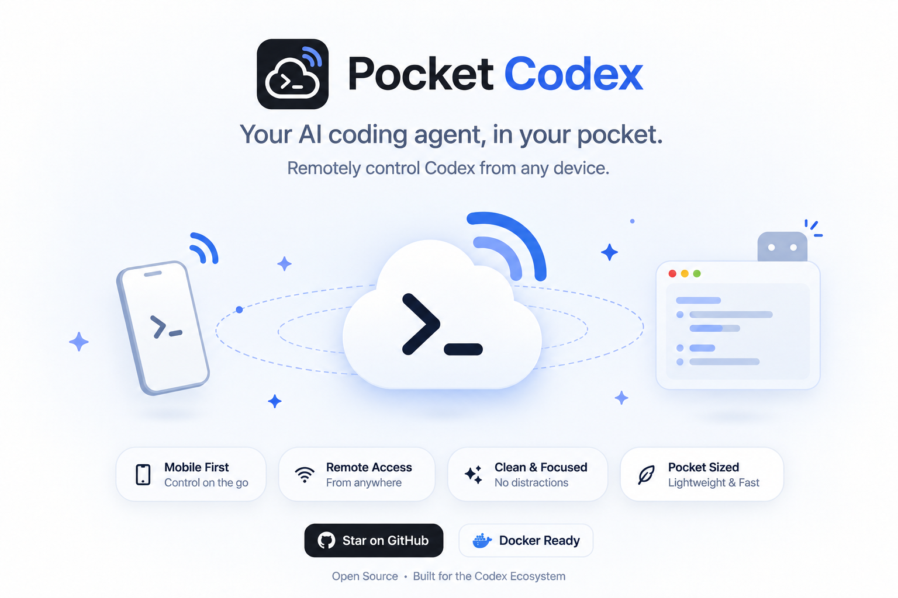

<p align="center">
  
</p>

<h1 align="center">Pocket-Codex</h1>

<p align="center">
  <em>Carry your Codex in your pocket. Drive it natively from any device.</em>
</p>

<p align="center">
  <a href="#status"></a>
  <a href="https://www.rust-lang.org"></a>
  <a href="https://flutter.dev"></a>
  <a href="LICENSE"></a>
</p>

<p align="center">
  <strong>English</strong> · <a href="README.zh-CN.md">中文</a>
</p>

> [!WARNING]
> **Pocket-Codex is under active development.** Nothing here is stable
> yet — APIs, on-disk layout, the protocol mapping and even the crate
> boundaries are expected to change without notice. Do **not** depend on
> it for production workloads. Pull requests, design feedback and bug
> reports are very welcome while we hammer out the foundations.

## What is this?

Pocket-Codex is an experiment in turning the upstream
[`codex app-server`](https://github.com/openai/codex) protocol into a
portable, multi-device experience, and additionally exposing the host's
Codex login as a relay-reachable Responses API endpoint for any device:

- A pure-Rust CLI manages a local `codex app-server` process on the
  machine where Codex is installed.
- The same CLI ships an in-process **Responses API proxy** that reuses
  the host's `codex login` (ChatGPT account or `CODEX_ACCESS_TOKEN`) to
  serve OpenAI-compatible `/v1/responses` HTTP + WebSocket traffic, so
  devices *without* Codex installed can drive the same model through
  the relay.
- The CLI uses [`pb-mapper`](https://github.com/acking-you/pb-mapper) to
  register either service under `pcx:<device>:<kind>:<name>` keys, or
  to subscribe to remote ones, materialising them as local TCP
  endpoints.
- A Flutter front-end (driven through `flutter_rust_bridge`) consumes
  the app-server JSON-RPC protocol directly, giving every platform a
  native UI for Codex without re-implementing model logic.
- **Two ways to connect.** *Self-host* — point every device at your own
  `pb-mapper` relay with a shared 32-byte key (the original flow).
  *Hosted account* — run the optional `pocket-codex-backend` once on your
  server, then every device just signs in with **GitHub**
  (`pocket-codex login`, or "Sign in with GitHub" in the app); the backend
  hands each account a short-lived relay credential scoped to its own
  `pcxu:<user>:…` namespace, and devices then talk to the relay directly. The
  relay's administrator key is never handed to clients, accounts can't see each
  other, and the backend isn't in the middle of your traffic.

In short: **one machine stays logged in to Codex; every other device —
the Flutter UI, a remote `codex` CLI, or any OpenAI-compatible tool —
reaches it through the relay**, either with a shared relay key (self-host)
or a per-account GitHub login (hosted).

## Status

| Area                           | State                                  |
| ------------------------------ | -------------------------------------- |
| Workspace / lints / CI         | bootstrapped                           |
| `pocket-codex` CLI             | `login`, `logout`, `account`, `init`, `serve`, `connect`, `api {serve,connect}`, `services {list,default set}`, top-level `status`/`stop`, `codex {start,stop,status}`, `pb {register,subscribe,status}`, `remote-hint`, `version` |
| `pb-mapper` register/subscribe | the published `pb-mapper` client SDK   |
| `codex app-server` supervision | spawn/stop/status via PID + state.toml |
| Embedded codex (desktop)       | desktop builds compile codex **in-process** behind the `embedded-codex` feature, so a machine can host without a separate `codex` install (Windows/macOS) |
| Direct Responses API proxy     | local HTTP/WS proxy registered through pb-mapper |
| Hosted account (GitHub)        | optional `pocket-codex-backend`: GitHub login, then a short-lived per-account relay credential (`/v1/relay`) scoped to a `pcxu:<user>:…` namespace — clients register/connect against the relay **directly** and the administrator key never leaves the server; self-host preserved behind `--relay`. See [`deploy/`](deploy/README.md) |
| Flutter UI (`apps/flutter`)    | chat-first home (opens straight into the latest session; all sessions in the sidebar; auto-connects to the explicit default / last-used / locally hosted / first reachable host, desktop auto-restores hosting); account onboarding ("Sign in with GitHub") + self-host onboarding (relay+key, `pcx1:` import/export); device-first service management, settings, sessions, and logs with shared secondary-page navigation; responsive Material 3 (light/dark) |

Multi-device CLI flows are usable in both modes:

- `pocket-codex login` / `logout` / `account` drive the **hosted-account**
  mode: a GitHub device-flow session (token stored 0600 in `config.toml`) makes
  `serve` / `connect` / `api` / `services` work with **no relay or key** — the
  backend vends a per-account credential and the CLI publishes under
  `pcxu:<user>:…` keys on the relay itself. The `--relay`
  examples below are the **self-host** mode, which an explicit `--relay` flag
  always selects (the escape hatch).
- `pocket-codex init [--relay <host:port>] [--key <32B>]` persists the
  default relay address and shared `MSG_HEADER_KEY` to
  `~/.config/pocket-codex/config.toml` (0600 on Unix). All subsequent
  commands default to this config (precedence: `--relay` flag > config >
  `$PB_MAPPER_SERVER`); `--relay` still overrides per-invocation.
- `pocket-codex serve --relay <host:port>` starts or reuses the local
  `codex app-server`, registers it as `pcx:<device>:app:<name>` and
  prints the matching client-side command.
- `pocket-codex connect --relay <host:port>` subscribes to the remote
  app-server selected by `--device` / local default / relay discovery,
  exposes it locally and prints the exact `codex --remote ...`
  invocation to start Codex against that listener.
- `pocket-codex api serve --relay <host:port>` exposes the host Codex
  login as a loopback Responses API proxy and registers
  `pcx:<device>:api:<name>`.
- `pocket-codex api connect --relay <host:port>` subscribes to that API
  proxy and prints a local `model_providers` config snippet for Codex.
- `pocket-codex services list --relay <host:port>` discovers available
  `pcx:*` services; `pocket-codex services default set ...` records the
  local default device when a command does not specify one.

See [`AGENTS.md`](AGENTS.md) for the detailed roadmap and contributor
conventions.

## Repository layout

```
pocket-codex/
├── apps/
│   └── flutter/                 # Flutter UI (FRB-driven, FVM-locked)
├── assets/
│   └── logo/                    # Project artwork (poster, logo)
├── crates/
│   ├── pocket-codex-core        # shared types, config, state, paths
│   ├── pocket-codex-codex       # codex app-server process manager
│   ├── pocket-codex-pb          # pb-mapper register/subscribe glue
│   ├── pocket-codex-cli         # `pocket-codex` binary
│   └── pocket-codex-bridge      # cdylib consumed by flutter_rust_bridge
├── deps/
│   ├── codex/                   # upstream codex (git submodule)
│   ├── pb-mapper/               # upstream pb-mapper (git submodule)
│   ├── kanal/                   # pinned fork transitively used by pb-mapper
│   └── uni-stream/              # pinned fork transitively used by pb-mapper
├── docs/                        # design notes & protocol references
└── skills/                      # contributor / agent skill packs
```

## Getting started

> Heads up: this is bootstrap-quality. CLI flags, on-disk state,
> protocol coverage and UI surface area are all expected to change.

### Install the CLI (one-liner)

Grab the `pocket-codex` binary from the latest release — no toolchain needed.
The installer picks the build for your OS + CPU (static-musl on Linux, native
on macOS/Windows) and drops it on your `PATH`.

```bash
# Linux / macOS
curl -fsSL https://raw.githubusercontent.com/acking-you/pocket-codex/main/scripts/install.sh | sh
```

```powershell
# Windows (PowerShell)
irm https://raw.githubusercontent.com/acking-you/pocket-codex/main/scripts/install.ps1 | iex
```

Overrides (env vars): `POCKET_CODEX_VERSION` pins a tag (e.g. `v0.1.3`),
`POCKET_CODEX_BIN_DIR` sets the install dir, `POCKET_CODEX_NO_MODIFY_PATH=1`
skips the PATH step. Prefer a package or a from-source build? See below.

### Rust workspace

```bash
# Clone with submodules (deps/codex).
git clone --recurse-submodules git@github.com:acking-you/pocket-codex.git
cd pocket-codex

# If you cloned without --recurse-submodules:
git submodule update --init --recursive

# Build everything in the workspace.
cargo build --workspace

# Inspect the CLI surface.
cargo run -p pocket-codex-cli -- --help
```

A working `codex` binary is expected to exist on `$PATH`; Pocket-Codex
does **not** vendor a model runtime. The CLI exposes:

```text
pocket-codex login                          # hosted account (GitHub)
pocket-codex logout
pocket-codex account
pocket-codex init                           # self-host (relay + key)
pocket-codex serve
pocket-codex connect
pocket-codex api      serve | connect
pocket-codex services list | default set
pocket-codex status
pocket-codex stop
pocket-codex codex   start | stop | status
pocket-codex pb      register | subscribe | status
pocket-codex remote-hint
pocket-codex version
```

#### Hosted account (recommended)

Sign in once with GitHub and every command works **without a relay address or
shared key**. Requires a reachable `pocket-codex-backend` — run your own; see
[`deploy/`](deploy/README.md).

> **Full step-by-step guide (CLI + app):** [`docs/usage.md`](docs/usage.md)
> （中文：[`docs/usage.zh-CN.md`](docs/usage.zh-CN.md)）。

```bash
pocket-codex login                 # GitHub device flow: open the URL, enter the code
pocket-codex account               # who you're signed in as + transport mode

# Host: expose this machine's codex app-server under your account.
pocket-codex serve

# Another device: sign in to the SAME GitHub account, then list + drive services.
pocket-codex services list
pocket-codex connect               # picks your default / only app-server
codex --remote ws://127.0.0.1:28080

# Or reach your Codex login as an OpenAI-compatible Responses API.
pocket-codex api serve
pocket-codex api connect

pocket-codex logout                # revoke + clear the local session
```

In the **app** this is just "Sign in with GitHub" on first launch; the same
account's app-servers then appear on the home screen, ready to drive.

#### Self-host (advanced)

Pass `--relay` (and set a shared 32-byte key via `init`) to bypass the account
backend and talk to your own `pb-mapper` relay directly. An explicit `--relay`
**always forces self-host mode**, even when you are logged in — it's the escape
hatch.

```bash
pocket-codex init    --relay relay.example.com:7666   # persist relay + 32B key
pocket-codex serve   --relay relay.example.com:7666   # host side
pocket-codex connect --relay relay.example.com:7666   # client side
codex --remote ws://127.0.0.1:28080
pocket-codex api serve   --relay relay.example.com:7666
pocket-codex api connect --device my-host --relay relay.example.com:7666
```

### Flutter front-end

`apps/flutter` is a Flutter app that talks to Rust through
`flutter_rust_bridge`. Flutter is locked at the project level via
[FVM](https://fvm.app/) (`.fvmrc`) and at the language level via
`pubspec.yaml`'s `environment.flutter` field; CI uses
`subosito/flutter-action@v2` against the same pin.

```bash
# One-time: install fvm and the pinned Flutter version.
brew tap leoafarias/fvm && brew install fvm
fvm install 3.44.0 --setup

# Day-to-day:
cd apps/flutter
fvm flutter pub get
fvm flutter analyze
fvm flutter test
```

If you change anything under `crates/pocket-codex-bridge/src/api/`,
re-run the codegen:

```bash
flutter_rust_bridge_codegen generate
```

## License

Pocket-Codex is licensed under the [Apache License 2.0](LICENSE).

The upstream projects under `deps/` keep their own licenses; consult
each submodule for details.
