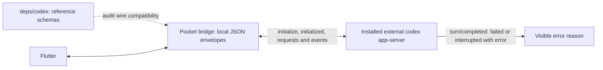

# App-server protocol sync: 2026-10-04

The reference is the requested `~/rust_pro/codex` working tree at
`17a9df60e420b58e3edc55efb1bb052e39492bbc`. The fork merges it at `91f3ad911`.
This identifies the audited source exactly; it does not assert that an external
Codex executable installed by a user was built from this commit.

Pocket-Codex still launches the installed external executable. The submodule is
the wire-schema reference, not a bundled runtime or a linked protocol library.



## Consumed surface

| Upstream change since `c08819510` | Pocket-Codex behavior |
| --- | --- |
| `Turn.error` can accompany an interrupted turn; `tooManyDenials` and `flexUnavailable` error information added | Show explicit terminal errors on failed or interrupted live turns. Ordinary interruption without an error stays quiet. Preserve the raw error JSON. |
| `thread/items/list.cursor` additionally accepts an item anchor object | Existing opaque string cursors remain supported and are passed back unchanged. No extra reads or translation are needed; Pocket does not expose item-anchor navigation. |
| MCP discovery adds optional `serverName` and `threadId` | Existing full-inventory calls remain valid. Unknown response fields are retained in wire values. |
| Enterprise MCP OAuth adds `loginId` and completion metadata | No enterprise login flow is added in this release; Pocket's existing account login behavior is unchanged. |
| Plugin summary drops obsolete extension metadata; account plan/error variants expand | Pocket does not deserialize these into closed upstream enums. No runtime dependency or compatibility shim is added. |
| Tool-call execution metadata changes within upstream model messages | The app-server item/event surface remains the integration boundary. Pocket does not interpret model-provider message internals. |

Initialization still waits for the initialize response before sending
`initialized`. Bounded history windows, model/service-tier discovery, async
questions, approvals and image references retain their existing contracts.
The upstream WebSocket fork revisions and Rust 1.95 compiler floor are unchanged.

## Local host identity

```text
systemd pocket-codex-host
  +-- Pocket host supervisor
  +-- npm / Node launcher
  |     +-- native codex app-server PID  <-- record this process
  |           +-- runtime worker TIDs   <-- never record these as the host PID
  +-- pb register worker

worker identity on Linux = boot ID + /proc/PID/stat start ticks
wall-clock synchronization changes neither part of that identity
```

An executable replaced by npm can remain alive as `codex (deleted)`. Status
recognizes it until a deliberate restart loads the replacement. Listener
matching uses an exact `--listen` argument, not a URL substring.

## Verification

Run the full first-party gates in `AGENTS.md`, including Flutter lifecycle
regressions for interrupted errors and ordinary interruptions. Audit the
resolved bridge dependency graph on all targets/features: it must contain no
Codex runtime/protocol crate. The Responses proxy's HTTP and WebSocket transport
tests exercise host authentication, streaming and error forwarding. Build the
desktop application and require the native macOS host CI result.

After local installation, verify the loaded native executable and SDK version,
app-server initialization, model/history requests and a relay round trip. A
submodule update alone does not upgrade an already-running external process.
