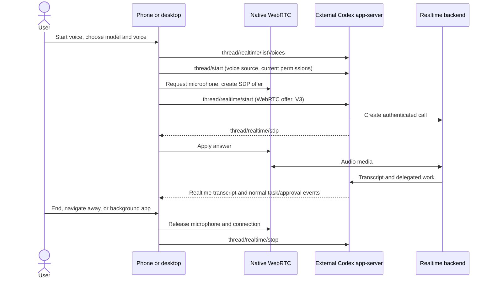
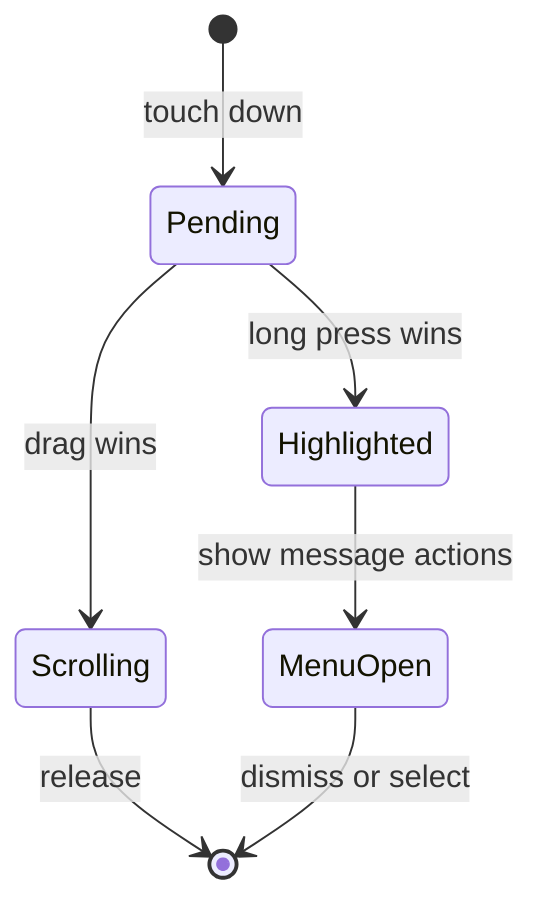

# Live voice through Codex app-server

Pocket-Codex starts a dedicated voice conversation from the waveform button
above the composer. An existing voice conversation can be reopened and started
again explicitly. Its waveform icon and “Live voice” label survive renaming,
restart and opening it from a different controller because Codex persists
`threadSource: "pocket-codex-voice"`.

The microphone, output audio, echo cancellation and encoding belong to the
controller's native WebRTC implementation. Codex still runs externally on the
selected host. This does not bundle any Codex runtime.



Only control messages use the existing app-server connection (and its relay,
when the host is remote). Audio uses WebRTC directly between the controller and
realtime backend; the controller therefore needs network access to that backend.
No host credential is copied into the controller. There is no continuous
recording, automatic reconnect, or background microphone use.

## Protocol contract

The implementation follows `deps/codex` upstream `afb436df8b`:

- `thread/realtime/start`: `outputModality: audio`, `version: v3`, WebRTC
  transport, optional model/voice overrides. V3 uses the `v1` list returned by
  `thread/realtime/listVoices`, including its `defaultV1`; V2 voices are different.
- `clientManagedHandoffs: false`: Codex owns delegation to the backing agent and
  its responses. Existing task activity and approval cards remain accessible
  while talking. The backing model and permission preset are inherited from the
  current composer when creating the voice thread.
- `thread/realtime/sdp`: answer delivered asynchronously. The start RPC's empty
  success does not mean audio is connected; native media connection state does.
- `thread/realtime/transcript/delta` and `/done`: bounded live display. Persistent
  speech is read separately from canonical `thread/timeline/list` pages, preserving
  `nextCursor` and retrying failures without claiming end of history.
- `thread/realtime/error`, `/closed`, transport failure and host disconnection:
  release native media and show a recoverable status. A 45-second startup timeout
  also releases the microphone. A late successful start after cancellation receives
  a second stop; a new startup cannot overlap the old pending startup.

The existing initialized bridge already opts into `experimentalApi`. Unsupported
hosts, denied microphone access, incompatible models, missing account access and
network failures are displayed; the presence of the voice catalog does not prove
that the account can create a call. WebRTC uses upstream host authentication.
The separate default WebSocket voice path requires API-key authentication and is
not selected by this UI.

## STT and TTS boundary

The user's requested scope is **app-server-supported voice only**. Live voice
transcription is displayed, but it is not independent composer dictation.

The protocol has no standalone recording-to-text RPC. Its V2 transcription
configuration is not a complete controller dictation contract: `appendAudio`
appends audio, while the app-server surface does not expose an audio-buffer commit
operation. We do not infer a supported dictation workflow from those types alone.

`appendSpeech` submits speakable text inside an existing realtime session; it is
not a standalone TTS endpoint. No reply-read-aloud UI, OS speech plugin, external
transcription endpoint or additional speech-provider configuration is added.

## Touch feedback



Touch-down no longer highlights or scales a message. Confirmed long press shows
feedback and a haptic selection cue; the highlight stays until the menu closes.
Mouse text selection and reduced-motion behavior are preserved.

## Source map and verification

- `crates/pocket-codex-bridge/src/engine/app_session.rs`: upstream forwarding and
  persisted thread-source parsing. No new runtime dependency.
- `apps/flutter/lib/src/voice/voice_transport.dart`: native media lifecycle.
- `apps/flutter/lib/src/voice/voice_controller.dart`: cancellation, signaling,
  call status and bounded live transcripts.
- `apps/flutter/lib/src/voice/voice_widgets.dart`: catalog/settings, call controls
  and paginated canonical voice history.
- `apps/flutter/test/voice_test.dart`: media/controller fakes, lifecycle races,
  protocol values and phone/desktop layouts.
- `apps/flutter/test/message_actions_test.dart`: scrolling must never activate
  long-press feedback; confirmed press/menu behavior and mouse selection.
- `apps/flutter/integration_test/voice_native_test.dart`: opt-in native audio-only
  SDP negotiation and an ordered data-channel round trip between two local peers.
  It requests neither a microphone nor a backend call. On Linux, run from
  `apps/flutter` (use `xvfb-run -a` when no display is available):

  ```bash
  fvm flutter drive -d linux --profile \
    --driver integration_test/voice_driver.dart \
    --target integration_test/voice_native_test.dart \
    --dart-define=PCX_NATIVE_VOICE=true
  ```

Widget tests cannot prove real microphone, Bluetooth routing, remote account
access, or audible playback. Native builds and real-device call checks are
separate verification steps; do not report a mock call as a successful live call.
