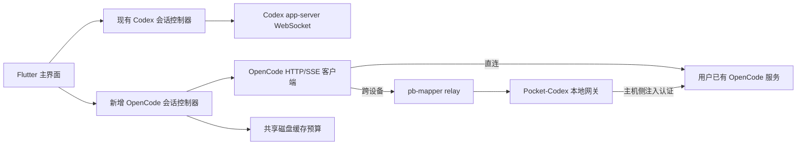

# OpenCode 会话连接与托管设计

状态：用户已接受首版方向，尚未实现。日期：2026-09-27。施工评估、测试接口及执行状态以 [任务清单](opencode-construction-plan.md) 为准。

本文记录设计、源码依据、实施顺序与验收标准。用户已授权按此设计施工，进度以任务清单为准。实现完成后，向 `acking-you/pocket-codex` 提交独立 PR，标题与正文使用中文。

## 1. 设计结论

在现有 Rust CLI、pb-mapper 和 Flutter 架构中新增独立的 OpenCode 通路。OpenCode 使用官方 HTTP 接口及 SSE；现有 Codex 继续使用 app-server JSON-RPC/WebSocket。两者共用服务发现、relay 传输、缓存存储及基础 UI，不把 OpenCode 事件伪装成 Codex 的 `turn/*` 协议。

新增 `opencode` 服务类型和 OpenCode 专用会话控制器。托管发布一个限制路由的本地 HTTP 网关，由网关持有上游凭据并连接现有 OpenCode 服务。远端控制设备无需得到 OpenCode 的服务器密码或模型供应商密钥。

三种操作必须分别建模：

| 操作 | 对 OpenCode 的影响 |
| --- | --- |
| 断开连接 | 关闭本控制器的 HTTP/SSE 连接，不中断会话 |
| 停止托管 | 撤销 relay 发布、停止 Pocket-Codex 网关，不停止用户已有的 OpenCode |
| 停止执行 | 用户明确操作后调用当前会话的官方 abort 接口，不结束 OpenCode 服务进程 |

## 2. 当前项目的约束与发现

本地分析基线为 `426833ed1b12793793c988dc2f2bc716beb895ea`。下列位置均已阅读实际源码。

| 现状 | 设计影响 | 源码位置 |
| --- | --- | --- |
| `ServiceKind` 目前只有 app/api/meta/unknown，字符串解析严格 | 新增 opencode，不能复用 app 造成协议误判 | `crates/pocket-codex-core/src/service.rs:38` |
| `AppSession` 持有 Codex `AppClient`、turn ID 和 JSON-RPC 审批状态 | 保留该实现，新增 OpenCode 控制器 | `crates/pocket-codex-bridge/src/engine/app_session.rs:126` |
| Codex 托管退出会按监听地址查找并停止进程 | OpenCode 禁止沿用该退出路径 | `crates/pocket-codex-bridge/src/engine/serve.rs:1065` |
| 已有只读 `SessionHistorySource` 扩展接口 | 可新增第二个真实历史适配器，无需再造历史同步协议 | `crates/pocket-codex-host-svc/src/history_sync.rs:24` |
| 当前历史消费端显式要求 codex/app-server-v2 | 新适配器必须有独立投影，不能只替换 provider 字符串 | `crates/pocket-codex-bridge/src/engine/session_sync.rs:108` |
| 首页与管理页多处只筛选 app，会话页直接消费 Codex 事件 | 按服务类型分派；专用 OpenCode 会话页避免扩大 Codex 重构范围 | `apps/flutter/lib/src/screens/home_screen.dart:223`；`apps/flutter/lib/src/screens/app_session_screen.dart:2294` |
| config.toml、state.toml 使用 deny_unknown_fields | 新状态使用独立、带版本文件，避免旧二进制拒绝原有配置 | `crates/pocket-codex-core/src/config.rs:41`；`crates/pocket-codex-core/src/state.rs:49` |
| 正常服务发现直接查询 relay，但账户管理列表经过 backend 且只返回 app/api | 区分主连接路径与账户管理兼容性 | `crates/pocket-codex-bridge/src/engine/discovery.rs:19`；`crates/pocket-codex-backend/src/api.rs:320` |

仓库内部分说明保留了旧 broker 架构描述；本设计以当前代码的账户凭据直连 relay 为准。

## 3. 交付范围

首个实现 PR 必须包括：

1. 通过 URL 直连已有 OpenCode，支持无认证和官方 HTTP Basic 认证，明确项目目录上下文。
2. 将已有服务通过 Pocket-Codex 网关发布到自建 relay 或账户命名空间，其他设备可以发现和连接。
3. 会话列表、历史分页、创建会话、继续已有会话、SSE 文本与工具状态更新。
4. 当前权限请求的展示、允许一次、按上游语义允许后续请求、拒绝；处理其他客户端已经作答的情况。支持 question 的回答/拒绝，避免会话等待交互时无法继续。
5. 当前会话停止执行、断线重连与状态重建；不能因为断开、退出或托管失败而杀掉外部 OpenCode。
6. Codex 功能、旧配置、现有服务键、Responses API 的兼容回归。

本设计将用户提出的“托管”首先定义为**发布已有服务供其他设备访问**，这足以完成请求中的连接与托管链路。自动安装 OpenCode、管理供应商登录、编辑 OpenCode 全局配置、终端/PTY、工作区销毁、会话删除及公开分享不在首个 PR 范围。

“由 Pocket-Codex 启动 OpenCode 子进程”是可选后续扩展，不是连接已有服务的前提。第 8 节定义其所有权约束，首版不会暗中启动替代服务。用户已接受这一首版范围。

## 4. 架构与模块



### 4.1 模块归属

优先在已有 crate 内添加模块：

| 模块 | 责任 |
| --- | --- |
| core 的 `opencode` 模块 | 无凭据连接描述、版本化配置/运行状态、服务类型及路径 |
| host-svc 的 `opencode/{client,protocol,sse,gateway,history}` | 官方 HTTP 类型、SSE 解析、固定上游网关、只读历史适配器；供 CLI 与 bridge 复用 |
| bridge 的 `engine/opencode` | 连接注册表、会话状态归并、重连、发送/审批/停止、缓存投影 |
| bridge 的 `api/opencode.rs` | 新增类型化 FRB 接口，与原有 `api/bridge.rs` 接口并存 |
| CLI 的 `commands/opencode` | attach/publish、connect、status、stop 的命令调度 |
| Flutter 的 `opencode_api.dart` 与控制器 | 可替换的测试接口、会话选择与显示状态，不直接持有 HTTP 客户端 |
| Flutter 的 OpenCode 会话页 | 对话、分页、工具状态、审批与停止；复用主题、Markdown、可访问控件 |

不新增通用运行时 trait，不提前搬动整个 Codex 会话实现。现有 `SessionHistorySource` 已有明确只读契约，可直接增加 OpenCode 实现。host-svc 复用 workspace 已有 reqwest；SSE 使用经过维护的标准解析库，避免按网络 chunk 或简单换行切割 JSON。

### 4.2 标识与服务发现

- 自建模式：`pcx:<device>:opencode:<name>`。
- 账户模式：`pcxu:<user>:<device>:opencode:<name>`，继续由现有 `Transport` 完成命名空间转换。
- 不改变 `app`、`api`、`meta` 的含义。同一设备同名 Codex 与 OpenCode 可以并存。
- Flutter 内部目标包含 `provider + endpointProfileId/serviceKey + directory + sessionId`；不以临时 tunnel 端口或标题作为身份。
- URL、目录和会话 ID 作为结构化字段编码；路由中只传 profile ID 或服务键，不传密码。
- 同机托管使用已注册的 loopback 网关，不绕行 relay；移动端只承担控制，不扫描或启动本机服务。

后台 `/v1/services` 默认仍返回旧种类；新客户端通过显式 opt-in 参数请求包含 opencode 的列表。这样不会把新枚举强行发给非常旧的客户端。老 backend 不支持该参数时，主连接仍可通过 relay 发现，账户管理的缺失能力明确显示。跨账户 namespace 过滤必须保留。

### 4.3 应用内部接口草案

以下是 Pocket-Codex 内部接口草案，不是 OpenCode 官方端点名称：

```text
connect(profile) -> ConnectionView
listSessions(connection, query) -> SessionPage
openSession(connection, sessionId) -> SessionSnapshot
readOlder(connection, sessionId, cursor) -> MessagePage
createSession(connection, options) -> SessionInfo
sendMessage(connection, sessionId, input) -> SubmissionReceipt
replyPermission(connection, sessionId, requestId, decision) -> ReplyReceipt
replyQuestion(connection, sessionId, requestId, answers) -> ReplyReceipt
rejectQuestion(connection, sessionId, requestId) -> ReplyReceipt
abortSession(connection, sessionId) -> AbortReceipt
events(connection) -> stream<OpenCodeEvent>
disconnect(connection)
```

DTO 保留 OpenCode 的 session/message/part 原生 ID、role、parentID、时间和工具状态。一个用户消息可能对应多个 assistant 消息与工具步骤，不假装等于一个 Codex turn。未知 part 保留可显示的类型和受限原始详情，不推断出可执行审批。

## 5. 官方接口基线

推荐首个兼容基线为官方正式版 **v1.18.32**，tag 实际指向 `545f51d26cc39a907d2867492d498d9607ea5fa4`。GitHub release 的 `target_commitish` 为父提交 `f5ce4f881e477c7b75421cea2d20939f0ddd71fb`，不能混称为 tag SHA；已核对二者差异只涉及 package manifests 和 bun.lock。

接口事实、固定版本源码链接与文档差异记录在配套的 [官方接口研究](opencode-api-research.md)。实现时将据此冻结请求/响应 fixtures，并记录实际测试版本；不能只依据网页中的接口总表生成客户端，也不承诺所有历史/未来版本兼容。

连接时结合健康版本及有界读取的 `/doc` 检查所需路由和字段，不用会产生副作用的 POST 探测能力；兼容性检查允许无关新增字段。首版固定采用官方无 `/api` 前缀的接口族，不混入新 `/api/*` 或 `/experimental/*` schema。托管网关自身提供安全的 capability 摘要，不向远端开放整个上游配置面。

> 2026-09-27 适配更正：本节及下表是 1.18.32 的原始协议设计，**不满足用户安装的 OpenCode 2.0.18 的施工要求**。2.0.18 必须按 `/api/info`、`/openapi.json` 和原生 v2 模型重新设计协议适配，而不是修改 URL 前缀或复用旧 DTO。已核实差异、只读服务发现约束与验收缺口见 [2.0.18 研究](opencode-2.0.18-source-research.md)。在 v2 契约测试和真实桌面闭环通过前，不宣称该版本可用。

| 能力 | 官方接口 | 实现契约 |
| --- | --- | --- |
| 健康与版本 | `GET /global/health` | 读取健康及版本，认证失败不误判为离线 |
| 会话列表 | `GET /session` | 显式目录、limit 与查询范围；保留服务端返回的 session ID |
| 单会话/创建 | `GET /session/{sessionID}`；`POST /session` | 创建与查看分离，读历史不启动模型 |
| 执行状态 | `GET /session/status` | 配合 SSE 重建 busy/retry/idle，不能从最后一条 assistant 消息推断 |
| 历史 | `GET /session/{sessionID}/message?limit=20&before=...` | 数组含 message info 和 parts；读取 `X-Next-Cursor`/`Link`，网关保留或安全重写分页信息 |
| 单消息校准 | `GET /session/{sessionID}/message/{messageID}` | 校准快照/增量竞态以及提交状态未知的消息 |
| 继续对话 | `POST /session/{sessionID}/prompt_async` | 输入为官方 parts 结构；204 仅表示受理，不表示生成完成 |
| 实时事件 | `GET /event` | 按所选目录接收 SSE，不订阅全局事件混合各项目 |
| 待审批/回复 | `GET /permission`；`POST /permission/{requestID}/reply` | body 使用 `reply`，取值为 `once`、`always`、`reject`，另可带 `message`；不使用 Codex decision |
| 待提问/回复/拒绝 | `GET /question`；`POST /question/{requestID}/reply`；`POST /question/{requestID}/reject` | 使用官方 answers 数组结构；提问不冒充权限审批 |
| 停止执行 | `POST /session/{sessionID}/abort` | 只对指定会话请求取消；随后核对状态 |

需要特别保留的源码语义：

- 消息历史 `limit` 缺失或为 0 会读全量，因此客户端和网关必须强制正数上限。会话列表没有稳定 before/cursor，`start` 是更新时间下界；首版使用最近 100 条加服务端标题搜索，明确显示范围，不宣称全部加载。不能把消息的 before 参数套给会话列表。
- SSE payload 中即使有事件 id，也不等于 SSE 帧提供可恢复游标。核对版本的帧没有 SSE id/replay 保证。
- 官方网页仍列出旧 `/session/{id}/permissions/{permissionID}`；该路由仅作上游兼容，不作为新客户端首选。
- `always` 在此版本写入当前 OpenCode instance 内存中的批准规则，可能影响同 instance 的其他会话，不是“永久保存”，也不应标成“仅本会话允许”。
- `reject` 还可能拒绝同 session 的其他待审批请求；回复后重新核对整个该会话的待办，不只删除被点击的一张卡。
- 官方服务器认证为 HTTP Basic：`OPENCODE_SERVER_PASSWORD` 启用密码，`OPENCODE_SERVER_USERNAME` 可覆盖默认用户名 `opencode`。不假定它接受 OpenAI API Key 或 Bearer token。
- 新版服务端代码已拆到 `server/routes/instance/httpapi/{groups,handlers}`；实现依据为 CLI 实际使用的路由，不把仓库内其他协议包视为正在运行的服务。

核心事件至少覆盖 `message.updated`、`message.part.updated`、`message.part.delta`、message/part 删除、`session.updated`、`session.status`、`session.error`、permission asked/replied、question asked/replied/rejected。字段路径和可选性以研究文档对应源码及 fixtures 为准；不从事件名字猜 payload。

## 6. 实时状态、历史与并发

### 6.1 连接生命周期

`disconnected -> connecting -> synchronizing -> ready`；网络失败进入 `reconnecting`，认证失败进入 `authenticationRequired`，不支持的协议进入 `incompatible`。用户断开进入 `disconnected` 并撤销自动重连。

每条连接分配本地 generation。切换服务、账户、目录或关闭连接后，旧 HTTP 响应、SSE 回调、分页结果和审批回调不得写入新状态。每个连接只保留一条 SSE 订阅，事件再按 session ID 分派。

连接恢复时依次建立事件接收、读取当前历史/执行状态/待审批请求、归并并核对竞态，完成后才恢复发送和审批。不能把磁盘缓存中的按钮恢复为可操作审批。

### 6.2 SSE 与快照归并

- 上游事件没有经核实的可重放游标之前，不承诺断线后通过 `Last-Event-ID` 补齐。
- full part 更新按 `(sessionId, messageId, partId)` 替换，delta 只作用于当前连接中确认存在的文本基线。
- 快照读取期间，标记被事件触及的 message/part 为 dirty。不得把可能已包含于快照的 delta 再次追加；针对 dirty 消息补读权威快照，持续输出时合并刷新且有界重试。
- 重连、接收队列溢出、未知 delta 基线、事件解析失败时进入 resync，禁止静默丢字后继续声称状态完整。
- 处理 UTF-8 跨 chunk、CRLF、多行 data、注释/心跳、取消和大小上限；事件流不能为压缩而全量缓冲。
- UI 文本更新可按一帧合并，审批、错误、idle 和停止结果立即投递。网络失联不等于执行结束。

初始资源预算建议：普通 HTTP 请求 30 秒超时，流式读取独立采用心跳/空闲检测；解压后 JSON 响应至多 64 MiB，单 SSE 事件至多 8 MiB，归并队列同时受 1024 条和 32 MiB 限制。超过上限显示明确错误或执行有界校准，不能静默截断正文。这些值是本应用设计参数，不是上游保证，联调后可调整并记录依据。

### 6.3 发送与停止

发送之前确保 SSE 已建立。异步 HTTP 接收成功仅表示请求已接收，最终结果来自状态和消息事件。通过客户端生成且符合上游格式的 message ID 关联乐观消息；是否具有服务端幂等保证必须独立核实。

POST 超时后的结果标为“提交状态未知”，保留草稿并按 ID 查询历史，不能自动重复发送或自动重放审批。若无法证明上次请求未执行，用户重试也必须先看到该不确定状态。

首版已有任务运行时保留输入草稿，等待 idle 后再发送，不把 Codex `turn/steer` 或队列语义套到 OpenCode。不同客户端可同时观察同一会话，不触发 Codex force-resume 或进程接管。

停止针对上游的 session，而非 Codex 的 expected turn ID。按钮进入 stopping 后等待上游状态和历史核对；abort 失败不得显示已停止。若其他客户端恰好启动新任务，官方 session 级 abort 无法保证只停止旧任务，此限制必须在接口说明和竞态测试中体现。

### 6.4 历史与缓存

首屏请求有界尾部，默认目标 20 条消息，向前分页保持稳定 ID 和阅读锚点。完整性以官方分页信号为准，网络失败不变成“没有更多”。分页能力不足的版本必须明确限制，不能后台无界拉取全部历史。

OpenCode 历史投影使用独立 provider schema，通过现有 `SessionHistorySource` 读取 metadata/messages。网关可在自身 `opencode` 端口挂载 `/history/v1`，不复用 Codex `meta:<name>`，避免同名实例冲突。直连同一源时可在 bridge 内调用相同只读适配器。

复用现有全应用 512 MB 磁盘预算和单项上限；命名空间包含账户/relay 或直连 profile、provider、目录及 session。直连需要新增不依赖 relay 配置的 namespace 路径，不能把 URL 密码混入可显示标识。

OpenCode 若无跨重启可靠 source revision，重连时保守失效受影响历史窗口；缓存可以先只读显示，再由官方接口重建。不得用更新时间冒充保证检测所有 revert/删除的版本号，不得让新的 OpenCode generation 清空 Codex 数据。

## 7. 凭据与网关安全

上游固定为用户配置的 base URL，限制 scheme，拒绝 URL userinfo，拒绝携带认证的跨源重定向。URL query、fragment 不能作为密码传递通道。目录参数正确编码并固定到连接上下文；认证使用敏感 header，不写入请求调试输出。

直连时凭据只属于本控制器。通过 relay 托管时，上游用户名/密码只存在主机网关，网关重建允许的请求头，不转发控制器的 Authorization/Cookie，也不向客户端回传上游认证 header。OpenCode 自己管理的模型供应商密钥保持在 OpenCode，Pocket-Codex 不读取其凭据文件。

网关使用显式 route/method/query/body 白名单，只提供会话必需操作和历史同步，禁止通用 URL 代理。尤其不发布供应商认证、全局配置修改、任意文件、PTY、shell、instance dispose 或 global dispose。对缺失、重复或试图替换目录上下文的请求拒绝或规范化，不能利用 encoded path 绕过白名单。

directory 是上游上下文选择，不自动构成安全边界。已存在 session 的目录和 workspaceID 可以覆盖请求的目录。网关还须核对 session ID 所属目录/工作区，对 permission/question ID 从实时待办取得其 session 后校验；状态列表和事件也按同样规则筛选。首版只支持明确选定的主机本地目录，对 OpenCode 自身远程 workspace 明确报不支持。不得相信控制器声称的 sessionId 或用项目级列表替代目录限制。列表必须显式传 directory query，仅传目录 header 不足以过滤列表。`always` 本身具有实例级影响，因此不能把“每个网关固定目录”宣传为对上游授权效果的完整隔离。

网关只监听 loopback。账户模式沿用 relay 的账户 namespace 权限；自建模式沿用共享 relay 凭据的信任域，不能声称实现了共享密钥持有者之间的隔离。该主机本地回环端口沿用现有项目的本机用户信任模型，并不是抵御恶意同机进程的隔离层。直接访问远程上游并传密码时要求 HTTPS；localhost 或已建立的受保护隧道可使用 HTTP。

默认凭据仅保存在内存。CLI 通过交互隐藏输入、环境变量引用或权限受限文件读取，禁止 password 命令行参数。首版无需“记住密码”即可完成闭环；需要持久化时优先系统凭据库，若采用文件则必须验证 Unix 0600/目录 0700 和 Windows 用户专属 ACL，未支持的平台保持仅内存，不静默降级为公开文件。

错误返回只包含可诊断的状态码、端点操作名和脱敏摘要；不直接沿用会回显完整 anyhow 链的 meta 错误处理。测试使用唯一 canary 密码，检查日志、错误、状态、导出配置、路由、缓存和提交文件均不出现明文及 Basic 编码。此承诺覆盖应用处理的认证材料，不擅自修改用户在对话正文中主动输入的文本。

## 8. 托管生命周期与状态文件

首版 `Attached` 状态只拥有 Pocket-Codex 网关任务、relay 注册及客户端连接，**没有 OpenCode PID 或 kill 权限**。关闭窗口、正常退出、取消托管、relay 失联、健康检查失败和同名发布失败，只清理本应用资源。

推荐命令草案：

```text
pocket-codex opencode serve --url http://127.0.0.1:4096 --name work
pocket-codex opencode connect --device workstation --name work
pocket-codex opencode status
pocket-codex opencode stop --name work
```

`serve` 明确表示发布已有上游；默认前台运行，Ctrl-C 撤销发布但上游继续服务。`connect` 建立到受限网关的本地连接并输出无凭据地址。沿用 relay/account 参数选择机制；命令帮助必须把 `stop` 的对象写为 Pocket-Codex 托管。统一 `pocket-codex stop` 可清理新增托管，但不能因此停止上游。

首版使用独立 `opencode-v1.json` 存非秘密 profile/default target，`opencode-state-v1.json` 存托管记录；具体目录遵循 CLI 和 App 各自 support/config 路径。使用原子写、进程锁和显式版本，不向旧 `state.toml` 加字段。旧安装缺失新文件视为空配置；旧配置的导入导出保持原样。OpenCode 最近访问/自动托管偏好也单独存储，保留旧 `ui_state.json` 的 Codex lastServiceKey/autoHost 语义，避免降级版本误把 OpenCode 当 Codex 恢复。

自动恢复只恢复用户曾选择的 Attached 托管；缺密码或上游离线时停在待处理状态，不启动 OpenCode，不调用上游 dispose。没有可靠运行时所有权的历史记录不能获得终止权。

若后续扩展 `ManagedChild`：只允许显式启动外部 `opencode serve`，记录本次创建的 child handle/实例身份；关闭时只回收该拥有的子进程。不能按端口、进程名、陈旧 PID 查找并 kill；崩溃重启后无法证明所有权就降级为 Attached。该扩展需要单独验收 Windows、Unix 进程树回收。

## 9. Flutter 交互

服务管理页新增 OpenCode 类型、连接已有服务和发布已有服务操作。输入 URL、项目目录、可选用户名/密码；直连不应强制先配置 relay 或 Codex 登录。首次引导增加直连入口，但保留原有账户和自建流程。

首页可以选择 Codex 或 OpenCode，最近访问记录区分 provider。原有 Codex 用户未添加 OpenCode 时，首页行为不变。OpenCode 会话页提供项目上下文、会话列表、历史分页、输入框、运行/重试状态、权限卡和停止按钮。

OpenCode 不显示 Codex 专属的 Guardian、Fast、reasoning effort、sandbox/approval preset、force-resume 或 Plan 控制，除非后来有官方能力映射。工具与 Markdown 复用基础样式，不直接套用包含 Codex 特殊文本解释逻辑的整个 MessageView。

权限卡展示上游的权限名、目标/匹配范围和说明；`always` 标为当前 OpenCode 实例内的后续匹配请求授权，并提示可能覆盖其他会话，不能标成永久授权。仅在线、当前连接 generation、当前待审批列表中的请求可操作。按钮提交期间防重复，其他客户端完成后移除卡片。question 使用独立的单选/多选/文本回答控件和拒绝操作。

分页失败有显式重试；补加载保留已有消息；SSE 正文更新不抢走阅读位置。主题与控件遵循现有 theme/desktop_theme/UtilityPage，覆盖手机、平板、桌面及明暗主题。会话文件链接不得绕过既有主机来源校验；首版不为 OpenCode 自动启用主机任意文件读取。

## 10. 实施计划与输出契约

1. 冻结官方版本和契约 fixtures：核对健康检查、目录、分页、SSE、权限及 abort；完成最小 HTTP fixture server。
2. 在 core 增加 opencode 服务类型和独立 profile/state；补旧配置兼容、service key 和账户 namespace 测试。
3. 在 host-svc 添加类型化客户端、SSE 解析和只读历史适配器；先验证真实官方响应，再接 UI。
4. 添加受限网关及 CLI/bridge 托管入口；验证退出、断线与发布失败不会终止已有服务。
5. 添加 bridge OpenCode 状态机、FRB 接口和 Flutter 独立控制器；完成会话列表、历史、发送、审批和停止。
6. 接入首页/管理页/直连引导及新 provider 缓存；补 account backend 的显式种类协商和降级提示。
7. 执行下节验证；根据失败修正，再更新 README Status、AGENTS roadmap、用户文档与中文 PR。

主要预期变更：`core/src/service.rs` 与新增 `core/src/opencode.rs`；`host-svc/src/opencode/` 与 manifest；`cli/src/cli.rs`、`commands/opencode/`、服务选择/status/stop；`bridge/src/engine/opencode/`、`api/opencode.rs`、模块导出及生成绑定；Flutter 新增 OpenCode API/控制器/页面，并修改 `service_key.dart`、`router.dart`、首页/管理/引导及本地化；backend 的服务列表协商与测试；相关 docs。

原则上不修改 Codex 子模块、模型运行时、Responses 代理认证及现有 Codex 会话协议。若需要新依赖，锁文件只包含相关变化；Flutter 依赖变更同步 desktop pubspec。具体文件拆分可随实现调整，但不得借机全量重构 `app_session_screen.dart`。

## 11. 验证与验收

| 层次 | 必须覆盖 |
| --- | --- |
| 协议契约 | 固定官方版本字段、认证正确/缺失/错误、编码目录、404/429/5xx、prompt 受理与最终状态分离 |
| SSE | 任意分块/UTF-8/CRLF/多行、part snapshot 与 delta 顺序、未知事件、断线、慢消费者、取消、重复快照不重复文本 |
| 并发 | 快照期间增量、切换 A/B 后迟到响应、外部写入、删除/revert 后缓存失效、POST 结果未知不重发 |
| 历史/UI | 有界首屏和分页、长消息/工具输出、滚动锚点、重启缓存只读、超额淘汰与 Codex 缓存隔离 |
| 审批与提问 | 允许一次/允许后续/拒绝及实例范围、question 回答/拒绝、重新连接恢复、重复点击、另一客户端已回复、缓存审批不可执行 |
| 停止 | 当前会话 abort、失败/超时/竞态、停止后可继续会话、其他会话与服务健康不受影响 |
| 所有权 | 已有服务在退出、Ctrl-C、停止托管、初始化失败、relay 失联和重连后仍存活；不能只测 mock 的 stop 调用次数 |
| 安全 | canary 凭据不泄漏、重定向、恶意 URL/路径/目录、禁止路由、SSE 流不泄露无关项目事件、账户 namespace 隔离 |
| Codex 回归 | app/api/meta 发现与默认选择、旧配置、托管恢复、历史分页、实时消息、审批、停止、Responses HTTP 和 WebSocket |

真实 OpenCode 测试使用临时工作目录、隔离的数据/config 目录和测试专用端口。测试创建自己的进程但将它作为“用户已有服务”交给 Pocket-Codex，验收后仅由测试夹具回收自身进程。不会向用户已有会话发送测试消息或终止用户正在运行的任务。

真实模型端到端需要合法可用的供应商配置及用户授权的测试环境。无模型凭据时仍可验证健康、认证、空会话/历史、SSE 连接、网关、relay 和生命周期；实际生成、真实工具审批、执行中 abort 必须标注未验证，不能用 HTTP mock 结果替代。

按 AGENTS §7 顺序运行全部 first-party Rust fmt、workspace clippy、locked tests，以及 Flutter pub get、format、analyze、test；不并行重复 Rust 构建，不格式化 deps/vendor，检查磁盘空间。接口修改后重新生成 FRB 绑定，执行桌面构建与上述 UI 视口检查。不能运行的平台记录原因及补验命令，不写“全平台通过”。

发布验收必须形成事实矩阵：命令、环境/版本、通过/失败/跳过、对应日志或测试位置。设计阶段没有这些运行结果。

## 12. 独立 PR 交付

当前远端检查结果：

- 本地分支为 `main`，origin 为 `https://github.com/WaBranium/pocket-iteration.git`。
- GitHub API 确认该仓库 `isFork=false`，不能假设它是目标仓库的 fork。
- 目标 `acking-you/pocket-codex` 默认分支为 `main`；本次读取的 HEAD 为 `7d64e9db1cb786b3bb29902a6eeacd23f9e44bfe`。该值会变化，提交前必须重新读取。

实现交付应在目标仓库最新 main 的独立分支/隔离检出上进行，使用 WaBranium 在同一 GitHub fork 网络中的仓库提交。仅迁移本功能补丁，不能把当前 Initial commit 或整个项目快照作为 PR 内容。没有共同历史时通过变更补丁移植，检查最终与 upstream merge-base 的差异。

推送与创建 PR 前重新执行 `gh auth status` 和 `gh api user`，确认当前身份为 `WaBranium`；检查 fetch/push 远端、fork parent、base/head 分支及新增提交。身份或远端不匹配时停止发布并说明实际情况，不覆盖用户登录态，不自动向错误仓库推送。

建议标题：`新增 OpenCode 会话连接与托管支持，兼容现有 Codex 功能`。

正文使用中文，包含实际完成的功能、外部服务不会被终止的证据、认证隔离、官方接口版本、已运行测试、未验证平台/真实模型限制及兼容说明。测试未达标则如实记录，不以本设计中的验收计划充当已完成结果。

## 13. 本轮验证边界

本轮仅做本地源码阅读、官方文档/源码契约核对及 GitHub 仓库元数据读取，产出设计与研究文档。没有修改业务代码，没有运行 Rust/Flutter 全套构建测试，没有连接用户的 OpenCode，没有验证真实模型输出，没有创建或推送实现 PR。

环境探测中 `command -v opencode`、`command -v cargo`、`command -v fvm` 均未在当前 shell PATH 找到命令；这不证明机器上没有安装，但真实联调和构建前需先定位或准备工具链。当前没有重新确认 GitHub 登录身份，只读取了公开仓库元数据；发布前仍须按第 12 节重新确认。
