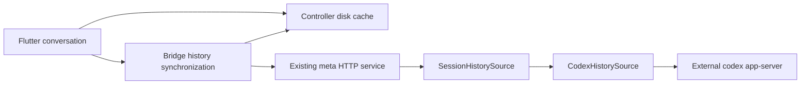

# Controller history cache and synchronization v1

The controller App keeps history on disk and renders a bounded cached snapshot
before discovering or reconnecting to its host. The host remains authoritative.
After capability negotiation, history reads use content-verified deltas on the
existing meta service. Sending turns, resuming, taking ownership and answering
approvals keep their existing app-server paths.

## Boundaries

`SessionHistorySource: Send + Sync` is the extension boundary explicitly requested
for future history providers. Its only methods are `provider()` and the async
`read_window(&WindowQuery)`. A source supplies stable document IDs, their order,
opaque pagination metadata, and a source generation that changes on destructive
history updates. Reading must not take ownership or start model work.

The core protocol knows JSON documents and UTF-8 text; it has no Codex runtime
dependency. `CodexHistorySource` is the first production implementation. A second
provider fixture tests the HTTP protocol without Codex. Adding another production
provider requires its adapter and a client projection for that provider's document
schema; the current conversation UI explicitly negotiates `codex/app-server-v2`.



This adds a module to the existing meta service, without a new daemon or an
embedded model engine. The host stores only small bounded rollout scan indexes;
it does not retain a second transcript or a replay log for each controller.

## Wire contract

| Endpoint | Behavior |
| --- | --- |
| `GET /history/v1/capabilities` | Version, provider schema, document limit, text-append support |
| `POST /history/v1/window` | Bounded query plus optional retained-content manifest; returns authoritative membership, changed documents and text suffixes |

Queries select a session, collection, optional group, opaque cursor, limit and
projection. The Codex adapter exposes `metadata`, `items` and `groups`. The normal
tail contains 20 items; the protocol permits at most 100 documents per window.
Existing turn-summary pagination remains available and is also synchronized.

The App fingerprints only documents it actually retains: the whole JSON document
and up to 128 large text fields per document, identified by JSON pointer, UTF-8
byte count and SHA-256. If the source still has that prefix, it sends a suffix and
a replacement template for other fields. A rewrite sends the changed document.
Unchanged documents have no body in the response. The response's order is
authoritative, including removals from that window.

The client verifies the old document, each reused text prefix and the reconstructed
document before atomically publishing the window and its pagination metadata.
Duplicate application is idempotent. Eviction or corruption produces a cache miss
and a bounded window fetch, without claiming an evicted synchronization base.

Generation changes discard other windows for that session, reject queued old live
checkpoints and invalidate in-flight pagination. The requested window is repaired;
other history loads only when requested. An invalid provider cursor returns HTTP
410 and requires reopening the session for a fresh bounded window. A failed read
never means end of history. During a replacement that races a multi-page read,
the normal history loader retries once rather than merging old and new pages.

Only a 404 from the capability endpoint selects legacy behavior. Negotiation,
version, timeout or synchronization failures stay visible and do not silently
download whole history. On a new meta service backed by a legacy Codex thread,
Codex explicitly disallows `items/list`: that adapter projects a bounded window
from a host-local whole-history read. Remote transfer still uses deltas, but this
legacy path does not eliminate Codex's host-side whole-history parsing cost.

## Cache policy and UI

The cache lives at `<App support directory>/session-cache-v1`. Account/backend or
relay/key identity and the logical service identify a hashed namespace. Temporary
tunnel ports and expiring access tokens are not cache identities. Credentials are
not stored in cache files. On Unix, the directory is private and files use 0600.

```toml
[history_cache]
disk_limit_mb = 512
```

Settings exposes usage and capacity. The limit is shared by all hosts and sessions
in that App installation; zero disables persistence and evicts existing entries.
MB means 1,000,000 bytes. Accounting includes entry headers and staged replacement
file lengths. Filesystem allocation-unit overhead and directory metadata are not
included. In-memory snapshots retain their separate eight-thread / approximately
32 MiB budget.

Eviction removes individual windows or previews: current-session entries have
highest priority, recently refreshed running tails come next, then other entries
ordered by last access. Running priority has a 30-second lease, refreshed by
prefetch or live checkpoints, so vanished sessions cannot remain pinned forever.
Even a single active session cannot exceed the global budget. Writes reserve
space before staging and discard orphan staging files after a crash.

Already requested image-preview bytes share this budget. There is no automatic
attachment download; explicit downloads keep their separate destination and are
not evicted as cache. The App prefetches at most two running-session tails serially
per inventory poll, rotates through the running sessions, and skips the session
currently being read. Backgrounding stops new prefetch work; a request already in
flight may finish. Foregrounding resumes synchronization.

On startup or session opening, a disk snapshot appears with a cache/sync label.
Failure leaves it readable with explicit retry. Cached approvals cannot become
actionable; sending remains disabled until fresh state is loaded. Refresh preserves
the reading anchor when possible and drops windows from a superseded generation.
Live snapshots are coalesced to roughly one second and final turn events, with at
most two ordinary checkpoint jobs per connection; app death can lose the latest
uncommitted snapshot, which the next delta repairs.

### Deliberate limits

- The offline display snapshot retains at most 100 items and omits independent
  selected-turn windows. This is a disposable performance cache, not a complete
  offline session archive. Previously fetched raw pages can still serve as delta
  bases after reconnect.
- An individual cache entry is limited to 32 MiB. Larger responses remain usable
  online without persistence. Incoming decompressed synchronization responses are
  capped at 64 MiB; requests are capped at 512 KiB.
- Source indexes retain at most 256 rollouts and scan only appended records after
  initialization. Compaction records are streamed without retaining their large
  replacement text. An evicted index may require rescanning its rollout.
- No migration of the existing in-memory cache or replacement of a running host
  is required. Old clients keep using the existing endpoints.

## Verification

Verification in the isolated development worktree on 2026-09-25:

| Check | Result |
| --- | --- |
| First-party Rust formatting and workspace Clippy (`-D warnings`) | Passed |
| `cargo test --workspace --locked` | 338 passed, 8 opt-in tests ignored |
| Real Codex history test, explicitly enabled | 1 passed; included among the 8 normally ignored tests above |
| Flutter dependency resolution, formatting and analysis | Passed |
| `flutter test` | 522 passed, 3 skipped |

Protocol tests cover unchanged windows, UTF-8 suffixes, rewrites, removals,
generation replacement, missing/corrupt bases and duplicate response application.
Disk tests cover restart reuse, namespaces, eviction, torn writes, orphan staging
files and quota reduction. Pagination tests reject pre-replacement work. Widget
tests exercise cached first paint at phone, tablet and desktop widths in light and
dark themes, stale-state send blocking, and foreground prefetch scheduling.

The opt-in test creates a separate external app-server with temporary Codex home,
working directory, source index, controller cache and random loopback ports. It
uses synthetic history and makes no model request or connection to a running user
host:

```bash
PCX_TEST_CODEX_BINARY=/absolute/path/to/native/codex \
  cargo test -p pocket-codex-host-svc --locked --test history_sync_codex \
  -- --ignored --nocapture
```

With a 1,000,000-byte assistant message, the observed response JSON sizes were
1,000,894 bytes cold, 300 bytes after recreating the meta adapter and reloading the
client's disk base, and 932 bytes when another turn was appended. These measure
decompressed JSON payloads, not compressed network bytes or mobile latency. The
separate protocol suffix test verifies appending within a large existing message.
The real-runtime fixture exercises legacy history; pagination is covered by the
existing bridge protocol tests. Live relay and mobile-device latency have not been
benchmarked by these tests.

## Code index

| File | Responsibility |
| --- | --- |
| `crates/pocket-codex-core/src/history_sync.rs` | Versioned documents, manifests, reconcile/apply and verification |
| `crates/pocket-codex-host-svc/src/history_sync.rs` | Source trait, HTTP routes, Codex adapter and projections |
| `crates/pocket-codex-host-svc/src/history_sync_revision.rs` | Durable bounded source revision indexes |
| `crates/pocket-codex-bridge/src/engine/session_cache.rs` | App-wide disk quota, namespaces, atomic entries and eviction |
| `crates/pocket-codex-bridge/src/engine/session_sync.rs` | Negotiation, synchronized reads, display snapshots and live checkpoints |
| `crates/pocket-codex-bridge/src/engine/app_session_history_cache.rs` | Existing RAM snapshots and in-flight pagination invalidation |
| `apps/flutter/lib/src/screens/home_screen.dart` | Cached last-session entry before discovery |
| `apps/flutter/lib/src/screens/app_session_screen.dart` | Cached rendering, fresh-state reconciliation and status |
| `apps/flutter/lib/src/providers.dart` | Foreground inventory and bounded running-session prefetch |
| `apps/flutter/lib/src/screens/settings_screen.dart` | Disk budget and usage controls |
| `crates/pocket-codex-host-svc/tests/history_sync_codex.rs` | Isolated real external Codex integration |
| `apps/flutter/test/history_disk_cache_test.dart` | Cached UI and prefetch lifecycle regression tests |
